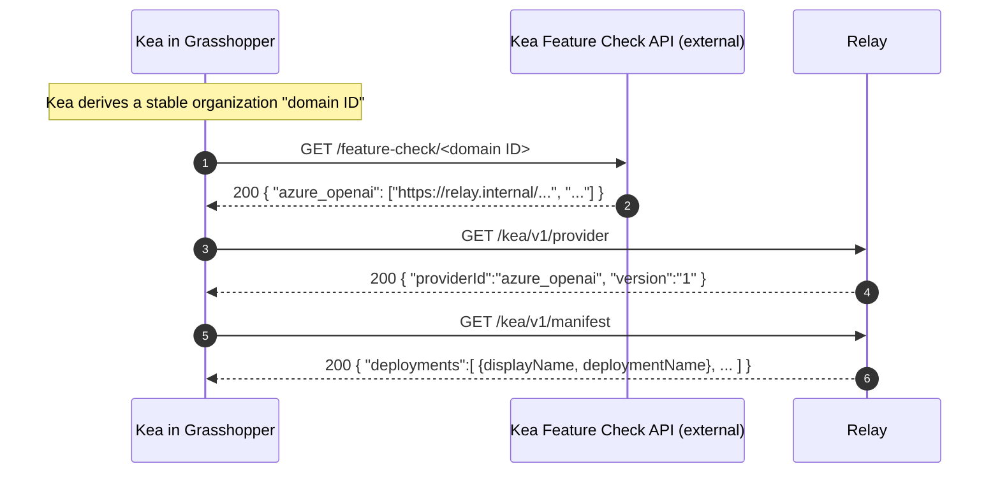
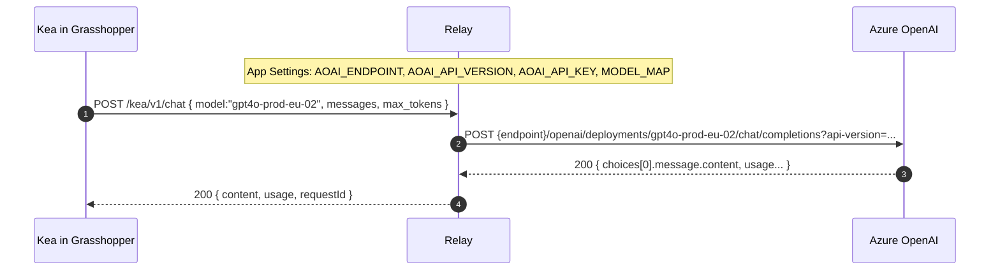

# Exchange Relay (Azure OpenAI) — for Kea (Grasshopper)

A minimal, open-source **relay** designed for **Kea** running inside **Grasshopper (Rhino)**.  
The relay runs in your organization’s Azure tenancy and forwards requests to **Azure OpenAI** using **server-side secrets**. Clients (Kea inside Grasshopper) do **not** carry or transmit API keys.

- **No client secrets:** API keys remain in Azure Function App settings or Key Vault.
- **Network-scoped access:** the relay is reachable only from inside the corporate network (see *Security considerations*).
- **Small, auditable surface:** concise codebase, Apache-2.0 licensed.
- **Future expansion:** the relay framework can be extended (e.g., restricted **SharePoint** access for Kea’s **DefinitionLibrary**).

> Project home for Kea: **https://github.com/nicolaasburgers/kea-plugin/**

---

## Table of contents

- [Overview (Kea in Grasshopper)](#overview-kea-in-grasshopper)
- [Endpoints](#endpoints)
- [Feature Check & request flow (diagrams)](#feature-check--request-flow-diagrams)
- [Configuration (App Settings)](#configuration-app-settings)
- [Security considerations](#security-considerations)
- [Deploy (Azure CLI quick start)](#deploy-azure-cli-quick-start)
- [Typical network layout](#typical-network-layout)
- [Local development](#local-development)
- [Operations & health](#operations--health)
- [Troubleshooting](#troubleshooting)
- [License](#license)

---

## Overview (Kea in Grasshopper)

**Kea** is a Rhino/Grasshopper plug-in. When a user launches Grasshopper, Kea determines an **organization domain ID** (stable per company) and discovers which AI providers are available.

Discovery is performed by an external service called the **Feature Check API** (hosted by the Kea vendor). The Feature Check API returns a dictionary mapping **provider IDs** to one or more **relay URLs**. Each relay URL is intended to be reachable **only** from inside the company network.

For **Azure OpenAI**, the client (Kea) then:
1. Calls the relay’s **provider** and **manifest** endpoints to discover **deployment names**.
2. Sends **chat completion** requests to the relay using the selected deployment name.  
   The relay injects the API key and forwards to **Azure OpenAI** within the organization’s subscription.

This repository contains the Azure Functions implementation of that **relay** for the **`azure_openai`** provider.

---

## Endpoints

> All endpoints are anonymous (no client API key). Control reachability via the **network boundary** described below.

**HTML landing pages** (200 OK; helpful if opened in a browser):
- `GET /`
- `GET /kea`
- `GET /kea/v1`

**JSON APIs**:
- `GET /kea/v1/provider` → `{ providerId, name, version }`
- `GET /kea/v1/manifest` → deployments as an **array** (friendly to .NET `DataContractJsonSerializer`):
  ```json
  {
    "providerId": "azure_openai",
    "name": "Exchange Relay",
    "version": "1",
    "deployments": [
      { "displayName": "GPT-4o (EU Prod 02)", "deploymentName": "gpt4o-prod-eu-02" },
      { "displayName": "GPT-4.1 (EU Prod 01)", "deploymentName": "gpt41-prod-eu-01" }
    ]
  }
  ```
  The list is generated from the `MODEL_MAP` app setting (see below).
- `POST /kea/v1/chat` (minimal request):
  ```json
  {
    "model": "gpt4o-prod-eu-02",     // AOAI deploymentName from manifest
    "max_tokens": 256,
    "messages": [ { "role": "user", "content": "Hello" } ]
  }
  ```

---

## Feature Check & request flow (diagrams)

> GitHub renders **Mermaid** diagrams in Markdown. They display inline on the repo page.

### 1) Feature Check (discovery) → relay selection (Kea specific)



### 2) Chat completion via relay (no client secrets)



---

## Configuration (App Settings)

Configure in Function App → **Configuration → Application settings**. Secrets may reference **Key Vault**.

| Setting | Required | Example | Notes |
| --- | :--: | --- | --- |
| `AOAI_ENDPOINT` | ✅ | `https://<your-aoai>.openai.azure.com` | Azure OpenAI resource endpoint |
| `AOAI_API_VERSION` | ✅ | `2024-06-01` | Use a validated version |
| `AOAI_API_KEY` | ✅ | *(secret)* | Key used by the relay to call AOAI |
| `MODEL_MAP` | ✅ | `{"GPT-4o (EU Prod 02)":"gpt4o-prod-eu-02","GPT-4.1 (EU Prod 01)":"gpt41-prod-eu-01"}` | JSON mapping `displayName → deploymentName` |
| `REQUEST_TIMEOUT_MS` | – | `60000` | Upstream timeout (ms) |
| `RELAY_VERSION` | – | `1` | Shown in `/provider` & landing pages |
| `AzureWebJobsDisableHomepage` | ✅ | `true` | Allows the relay to serve `/` (root) |

**PowerShell (CLI) example):**
```powershell
$rg  = "<resource-group>"
$app = "<function-app-name>"

az functionapp config appsettings set -g $rg -n $app --settings '
AOAI_ENDPOINT=https://your-aoai.openai.azure.com' '
AOAI_API_VERSION=2024-06-01' '
AOAI_API_KEY=<SECRET>' '
MODEL_MAP={"GPT-4o (EU Prod 02)":"gpt4o-prod-eu-02","GPT-4.1 (EU Prod 01)":"gpt41-prod-eu-01"}' '
REQUEST_TIMEOUT_MS=60000' '
AzureWebJobsDisableHomepage=true'

az functionapp restart -g $rg -n $app
```

---

## Security considerations

**Primary control: limit relay reachability to the company network.** Choose one of the following (or both) depending on your Azure plan and network posture:

1. **Private Endpoint (preferred)**  
   - Create a **Private Endpoint** for the Function App and integrate with your **VNet + Private DNS**.  
   - Internal clients resolve the relay hostname to a **private IP**. The relay is not reachable from the public Internet.  
   - Works well with ExpressRoute/VPN and internal DNS split-horizon.

2. **Access Restrictions (IP allow‑list) on the Function App**  
   - If a Private Endpoint is not feasible, configure **Access Restrictions** to allow only the organization’s **egress IP ranges** (and block all others).  
   - Maintain the allow‑list as corporate egress changes.

Additional recommendations:

- **Server-side secrets only:** the AOAI key is stored in App Settings or via **Key Vault references**; Kea never sends or stores the key.  
- **Least privilege:** use a dedicated AOAI resource or key scoped to required deployments; rotate keys regularly.  
- **Transport security:** only HTTPS is exposed; avoid terminating TLS before the Function App unless a WAF/proxy is required.  
- **Operational logging:** keep logs to **metadata and errors**; avoid emitting **request/response bodies** (prompts, completions) to logs.  
  In Application Insights, adjust sampling and filters to prevent payload capture if custom logging is added.

---

## Deploy (Azure CLI quick start)

From `apps/azure-openai-relay/`:

```powershell
npm install
npm run build
func azure functionapp publish <function-app-name> --no-build
```

Zip deploy (explicit contents):
```powershell
$zip = "$env:TEMP\exrelay.zip"
if (Test-Path $zip) { Remove-Item $zip -Force }
Compress-Archive -Path ".\dist", ".\node_modules", ".\host.json", ".\package.json", ".\package-lock.json" -DestinationPath $zip
az functionapp deployment source config-zip -g <rg> -n <app> --src $zip
```

Test:
```
GET  https://<app>.azurewebsites.net/
GET  https://<app>.azurewebsites.net/kea/v1/manifest
POST https://<app>.azurewebsites.net/kea/v1/chat
```

---

## Local development

Requirements: Node 18 or later, Azure Functions Core Tools v4, **Azurite** (or a real Storage account).

`local.settings.json`:
```json
{
  "IsEncrypted": false,
  "Values": {
    "FUNCTIONS_WORKER_RUNTIME": "node",
    "AzureWebJobsStorage": "UseDevelopmentStorage=true",
    "AzureWebJobsDisableHomepage": "true",

    "AOAI_ENDPOINT": "https://your-aoai.openai.azure.com",
    "AOAI_API_VERSION": "2024-06-01",
    "AOAI_API_KEY": "YOUR-KEY",
    "MODEL_MAP": "{\"GPT-4o (EU Prod 02)\":\"gpt4o-prod-eu-02\"}",
    "REQUEST_TIMEOUT_MS": "60000",
    "RELAY_VERSION": "1"
  }
}
```

Run:
```bash
# Start Azurite in another terminal (or Docker)
npx azurite --location .azurite

npm run build
func start
```

---

## Operations & health

- **Landing pages:** `/`, `/kea`, `/kea/v1` return a small HTML page (200) with non-sensitive status hints.
- **Provider info:** `GET /kea/v1/provider`
- **Manifest:** `GET /kea/v1/manifest` (driven by `MODEL_MAP`)
- **Logs:**  
  - Tail: `az webapp log tail -g <rg> -n <app>`  
  - App Insights: observe rates, latency, exceptions.

---

## Troubleshooting

- **`MODEL_MAP` parse error:** ensure the entire `KEY=VALUE` is passed as **one argument** to the CLI (single‑quote the whole pair or use a variable).  
- **Root `/` shows Functions splash page:** set `AzureWebJobsDisableHomepage=true` and restart the app.  
- **Routes include `/api`:** confirm `host.json` has `"routePrefix": ""` and redeploy.  
- **204 on root:** add `HEAD` to the allowed methods for the HTML endpoints.  
- **Build deployed without functions:** ensure `dist/index.js` imports `./functions/*.js`, and that `.funcignore` does **not** exclude `dist/` or `node_modules/` when using `--no-build`/zip deploy.

---

## License

Apache-2.0. See `LICENSE`.

---

**Security and platform reviews are welcome.**  
Project home for Kea (documentation, issues, discussion): **https://github.com/nicolaasburgers/kea-plugin/**
