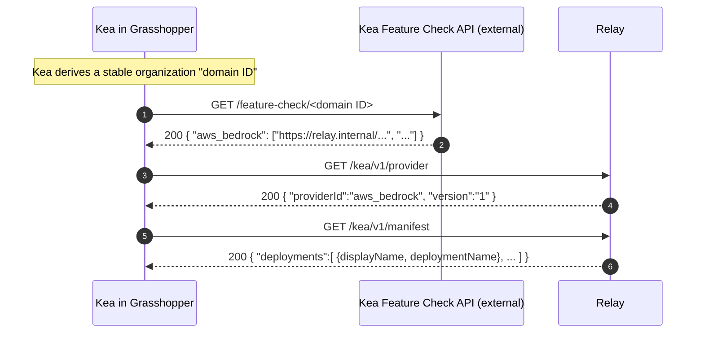
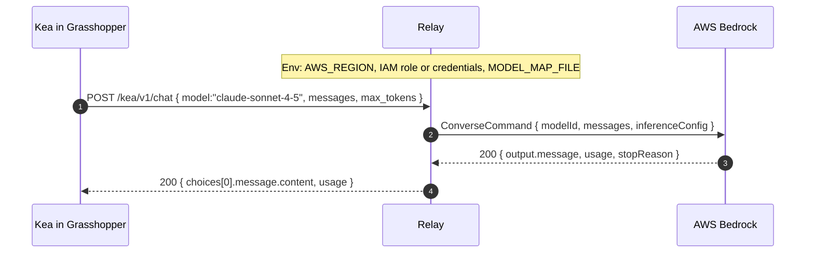

# Kea Relay

This repository contains a single relay app:

- `apps/kea-relay` — containerized Express service, AWS Bedrock provider

A minimal, open-source **relay** designed for **Kea** running inside **Grasshopper (Rhino)**.  
The relay runs inside your organization environment and forwards requests to approved models using server-side AWS credentials or runtime IAM identity. Clients (Kea inside Grasshopper) do **not** carry or transmit provider keys.

- **No client secrets:** AWS credentials stay in the container environment (IAM role, env vars, or mounted credentials file).
- **Network-scoped access:** the relay is reachable only from inside the corporate network (see *Security considerations*).
- **Small, auditable surface:** concise codebase, Apache-2.0 licensed.

> Project home for Kea: **https://github.com/nicolaasburgers/kea-plugin/**

---

## Table of contents

- [Overview (Kea in Grasshopper)](#overview-kea-in-grasshopper)
- [Endpoints](#endpoints)
- [Feature Check & request flow (diagrams)](#feature-check--request-flow-diagrams)
- [Configuration](#configuration)
- [Security considerations](#security-considerations)
- [Deploy (Docker)](#deploy-docker)
- [Local development](#local-development)
- [Operations & health](#operations--health)
- [Troubleshooting](#troubleshooting)
- [License](#license)

---

## Overview (Kea in Grasshopper)

**Kea** is a Rhino/Grasshopper plug-in. When a user launches Grasshopper, Kea determines an **organization domain ID** (stable per company) and discovers which AI providers are available.

Discovery is performed by an external service called the **Feature Check API** (hosted by the Kea vendor). The Feature Check API returns a dictionary mapping **provider IDs** to one or more **relay URLs**. Each relay URL is intended to be reachable **only** from inside the company network.

The client (Kea) then:
1. Calls the relay's **provider** and **manifest** endpoints to discover **deployment names**.
2. Sends **chat completion** requests to the relay using the selected deployment name.  
   The relay resolves the deployment to a Bedrock model ID and forwards the request using server-side AWS credentials.

---

## Endpoints

> All endpoints are anonymous (no client API key). Control reachability via the **network boundary** described below.

**HTML landing pages** (200 OK; helpful if opened in a browser):
- `GET /`
- `GET /kea`
- `GET /kea/v1`

**Health:**
- `GET /health` → `{ status: "ok" }`

**JSON APIs**:
- `GET /kea/v1/provider` → `{ providerId, name, version }`
- `GET /kea/v1/manifest` → deployments as an **array** (friendly to .NET `DataContractJsonSerializer`):
  ```json
  {
    "providerId": "aws_bedrock",
    "name": "AWS Bedrock Relay",
    "version": "1",
    "deployments": [
      { "displayName": "Claude Sonnet 4.5 (Approved)", "deploymentName": "claude-sonnet-4-5" }
    ]
  }
  ```
  The list is generated from the model map file (see [Configuration](#configuration)).
- `POST /kea/v1/chat` (minimal request):
  ```json
  {
    "model": "claude-sonnet-4-5",
    "messages": [ { "role": "user", "content": "Hello" } ],
    "max_tokens": 256
  }
  ```

---

## Feature Check & request flow (diagrams)

> GitHub renders **Mermaid** diagrams in Markdown. They display inline on the repo page.

### 1) Feature Check (discovery) → relay selection (Kea specific)


```mermaid
sequenceDiagram
  autonumber
  participant GH as Kea in Grasshopper
  participant FC as Kea Feature Check API (external)
  participant RL as Relay

  Note over GH: Kea derives a stable organization "domain ID"
  GH->>FC: GET /feature-check/<domain ID>
  FC-->>GH: 200 { "aws_bedrock": ["https://relay.internal/...", "..."] }

  GH->>RL: GET /kea/v1/provider
  RL-->>GH: 200 { "providerId":"aws_bedrock", "version":"1" }

  GH->>RL: GET /kea/v1/manifest
  RL-->>GH: 200 { "deployments":[ {displayName, deploymentName}, ... ] }
```

### 2) Chat completion via relay (no client secrets)


```mermaid
sequenceDiagram
  autonumber
  participant GH as Kea in Grasshopper
  participant RL as Relay
  participant BR as AWS Bedrock

  Note over RL: Env: AWS_REGION, IAM role or credentials, MODEL_MAP_FILE
  GH->>RL: POST /kea/v1/chat { model:"claude-sonnet-4-5", messages, max_tokens }
  RL->>BR: ConverseCommand { modelId, messages, inferenceConfig }
  BR-->>RL: 200 { output.message, usage, stopReason }
  RL-->>GH: 200 { choices[0].message.content, usage }
```

---

## Configuration

The relay is configured entirely via environment variables and a model map file.

| Variable | Required | Default | Notes |
| --- | :--: | --- | --- |
| `AWS_REGION` | ✅ | — | e.g. `eu-west-1` |
| `MODEL_MAP_FILE` | ✅* | — | Path to a JSON model map file (see format below) |
| `MODEL_MAP` | ✅* | — | Inline JSON model map (alternative to `MODEL_MAP_FILE`) |
| `PORT` | – | `8080` | HTTP port the server listens on |
| `RELAY_VERSION` | – | `1` | Shown in `/kea/v1/provider` and landing pages |
| `RELAY_NAME` | – | `AWS Bedrock Relay` | Shown in `/kea/v1/provider` |
| `DEFAULT_MAX_TOKENS` | – | `4096` | Applied when `max_tokens` is omitted from the chat request |
| `REQUEST_TIMEOUT_MS` | – | `60000` | Upstream Bedrock call timeout (ms) |

\* One of `MODEL_MAP_FILE` or `MODEL_MAP` is required.

**AWS credentials** are resolved in the standard AWS SDK credential chain: IAM instance/task role (recommended for EC2/ECS), `AWS_ACCESS_KEY_ID` / `AWS_SECRET_ACCESS_KEY` env vars, or a mounted credentials file.

### Model map file format

See `apps/kea-relay/models.json.example` for a full example. The supported format is:

```json
{
  "providerId": "aws_bedrock",
  "name": "AWS Bedrock Relay",
  "version": "1",
  "deployments": [
    {
      "displayName": "Claude Sonnet 4.5 (Approved)",
      "deploymentName": "claude-sonnet-4-5",
      "provider": "aws_bedrock",
      "bedrockModelId": "global.anthropic.claude-sonnet-4-5-20250929-v1:0",
      "maxTokens": 4096
    }
  ]
}
```

---

## Security considerations

**Primary control: limit relay reachability to the company network.**

- **Private/internal networking (preferred):** deploy the container into a private subnet or internal load balancer with no public ingress. Internal clients resolve the relay hostname to a private IP via split-horizon DNS.
- **IP allow-list:** if full network isolation is not feasible, restrict inbound access to the relay port to the organization's egress IP ranges only.

Additional recommendations:

- **IAM role (preferred over static keys):** run the container on EC2 with an instance profile or ECS with a task role. No AWS key or secret needs to be passed at runtime. Scope the role to `bedrock:InvokeModel` on approved model ARNs only.
- **Static credentials (if IAM role is unavailable):** pass `AWS_ACCESS_KEY_ID` and `AWS_SECRET_ACCESS_KEY` as secrets through your container orchestrator's secret management — never hard-code them in the image or model map file.
- **Transport security:** terminate TLS at a load balancer or reverse proxy in front of the container; the container itself serves plain HTTP on port 8080.
- **Operational logging:** keep logs to metadata and errors; avoid emitting request/response bodies (prompts, completions) to logs.

---

## Deploy (Docker)

### 1. Build the image

From the repository root:

```powershell
docker build -t kea-relay:dev apps/kea-relay
```

### 2. Run the container

**On EC2 with an IAM instance profile role** (no credentials needed):

```powershell
docker run -d --name kea-relay --restart unless-stopped `
  -p 8080:8080 `
  -e AWS_REGION=eu-west-1 `
  -e MODEL_MAP_FILE=/config/models.json `
  -v /opt/kea-relay/models.json:/config/models.json:ro `
  kea-relay:dev
```

**With explicit AWS credentials** (e.g. local testing or environments without instance identity):

```powershell
docker run -d --name kea-relay --restart unless-stopped `
  -p 8080:8080 `
  -e AWS_REGION=eu-west-1 `
  -e AWS_ACCESS_KEY_ID=$env:AWS_ACCESS_KEY_ID `
  -e AWS_SECRET_ACCESS_KEY=$env:AWS_SECRET_ACCESS_KEY `
  -e MODEL_MAP_FILE=/config/models.json `
  -v "$PWD/apps/kea-relay/models.json.example:/config/models.json:ro" `
  kea-relay:dev
```

### 3. Verify

```
GET  http://<host>:8080/health
GET  http://<host>:8080/kea/v1/manifest
POST http://<host>:8080/kea/v1/chat
```

### Azure deployment (same image)

The same image runs in Azure Container Apps (internal environment), App Service for Containers, or a VM with Docker. Keep ingress internal and supply the model config via a mounted file or `MODEL_MAP` env var.

---

## Local development

Requirements: Node 20, AWS credentials available in the shell.

```powershell
cd apps/kea-relay
npm install
npm run build

$env:AWS_REGION     = "eu-west-1"
$env:MODEL_MAP_FILE = "./models.json.example"
npm start
```

---

## Operations & health

- **Health:** `GET /health` → `{ status: "ok" }`
- **Landing pages:** `/`, `/kea`, `/kea/v1` return a small HTML page (200) with non-sensitive status hints.
- **Provider info:** `GET /kea/v1/provider`
- **Manifest:** `GET /kea/v1/manifest` (driven by the model map file)
- **Logs:** the relay logs request metadata and errors to stdout; collect with your container runtime's log driver.

---

## Troubleshooting

- **Model map parse error:** check that `MODEL_MAP_FILE` points to a valid JSON file and that the file is mounted correctly into the container.
- **`NoCredentialProviders` / auth error from Bedrock:** verify `AWS_REGION` is set and AWS credentials are available (instance role, task role, or explicit env vars).
- **`ResourceNotFoundException` from Bedrock:** the `bedrockModelId` in the model map does not exist in the configured region, or the model requires an inference profile ARN.
- **404 on all routes:** confirm the container started successfully (`docker logs kea-relay`) and that `PORT` matches the published port.

---

## License

Apache-2.0. See `LICENSE`.

---

**Security and platform reviews are welcome.**  
Project home for Kea (documentation, issues, discussion): **https://github.com/nicolaasburgers/kea-plugin/**
